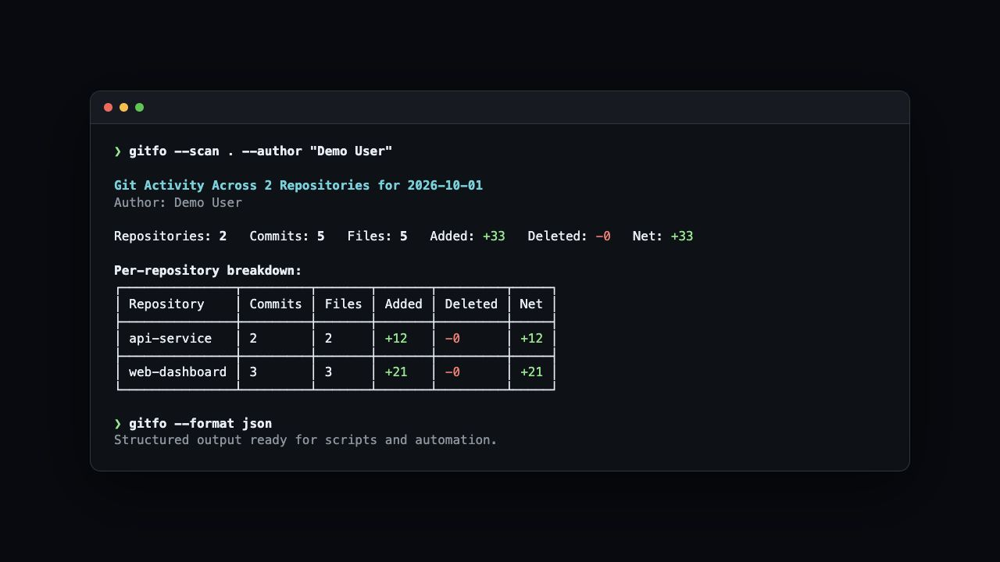

<div align="center">

# [📊 Gitfo](https://github.com/handshek/gitfo)

Gitfo is a small TypeScript CLI for reviewing daily coding activity from Git
history. It can analyze the current repository or scan a directory containing
multiple repositories, then render the result as a terminal table, one-line
summary, or JSON.

[](https://github.com/handshek/gitfo/actions/workflows/ci.yml)
[](LICENSE)
[](package.json)



</div>

## ✨ Features

- **Activity totals:** Count commits, files changed, lines added, lines deleted, and net change.
- **Single or multi-repository analysis:** Analyze one repository or aggregate multiple repositories in parallel.
- **Flexible filtering:** Filter by date range and author name or email.
- **Merge handling:** Exclude merge commits by default, with an option to include them.
- **Multiple output formats:** Render human-readable tables, script-friendly summaries, or structured JSON.
- **Verbose output:** Show full per-commit details with verbose table output.
- **Resilient scanning:** Continue a multi-repository scan when an individual repository fails.
- **Fast and portable:** Built with Bun and compatible with Node.js 18 or newer.

## 🧰 Requirements

- Git
- Node.js 18 or newer
- Bun 1.0 or newer for development and building from source

## 💻 Getting Started

Gitfo is currently installed from source:

```bash
git clone https://github.com/handshek/gitfo.git
cd gitfo
bun install --frozen-lockfile
bun run build
npm link
```

After linking, `gitfo` is available from any directory. Run
`npm unlink -g gitfo` to remove the global link.

You can use `bun link` instead of `npm link` when working entirely with Bun.

## 🚀 Usage

Run Gitfo inside a Git repository to analyze today's activity:

```bash
gitfo
```

Example summary:

```text
Commits: 4 | Files: 11 | +286 | -73 | Net: +213
```

Common commands:

```bash
# This week in the current repository
gitfo --this-week

# A specific date range
gitfo --since 2026-01-01 --until 2026-01-31

# Commits matching an author name or email
gitfo --author "user@example.com"

# Aggregate repositories found under one or more directories
gitfo --scan ~/projects ~/work

# Machine-readable output
gitfo --format json

# A single output line suitable for scripts
gitfo --format summary

# Every matching commit with author and diff details
gitfo --verbose

# Include merge commits in the totals
gitfo --include-merges
```

Run `gitfo --help` for the complete option list.

## ⚙️ Options

| Option | Description |
| :--- | :--- |
| `-s, --scan <paths...>` | Scan multiple repositories in specified directories |
| `-d, --date <date>` | Show stats for a specific date (`YYYY-MM-DD`) |
| `--since <date>` | Show stats from a specific date (`YYYY-MM-DD`) |
| `--until <date>` | Show stats until a specific date (`YYYY-MM-DD`) |
| `-t, --today` | Show stats for today |
| `--yesterday` | Show stats for yesterday |
| `--this-week` | Show stats for this week |
| `--last-week` | Show stats for last week |
| `-w, --week` | Alias for `--this-week` |
| `-a, --author <name\|email>` | Filter by Git author name or email |
| `--format <type>` | Output format: `table`, `json`, or `summary` |
| `--include-merges` | Include merge commits in stats |
| `-v, --verbose` | Show detailed commit information |
| `-V, --version` | Display the installed version |
| `-h, --help` | Display help |

## 📅 Date Filters

Gitfo defaults to today. The following date modes are available and mutually
exclusive:

| Option | Range |
| --- | --- |
| `--date YYYY-MM-DD` | One calendar day |
| `--since YYYY-MM-DD` | From a date through now |
| `--until YYYY-MM-DD` | All history through a date |
| `--today` | Today through the current time |
| `--yesterday` | The previous calendar day |
| `--this-week`, `--week` | Monday through now |
| `--last-week` | The previous Monday through Sunday |

## 📤 Output Formats

- `table` is the default interactive terminal output and shows up to five
  recent commits unless `--verbose` is used.
- `summary` writes one clean line to stdout for shell scripts.
- `json` includes commit records, analysis failures, repository failures, and
  aggregate totals.

## 🔎 Scan Behavior and Limitations

- Repository discovery searches three directory levels deep by default.
- Discovery skips `.git`, `node_modules`, and Git-ignored paths when Git can
  evaluate the ignore rules. Outside a Git worktree, the fallback ignore parser
  supports common literal directory patterns but not every `.gitignore`
  feature.
- Gitfo stops descending after it finds a repository root, so nested
  repositories are not included beneath that root.
- Without `--author`, Gitfo uses the current or global Git user name, then
  email. Scan mode applies that identity to every discovered repository.
- “Files changed” is the sum of files touched per commit, not a count of unique
  files across the complete date range.

## 🛠️ Development

```bash
bun install --frozen-lockfile
bun run test
bun run test:coverage
bun run build
bun run test:package
```

Continuous integration runs the test suite, build, coverage report, and packed
installation smoke test on the minimum supported Node.js release and a current
Node.js release.

### Release checklist

```bash
bun run test
bun run build
node dist/index.js --version
node dist/index.js --help
bun run test:package
```

## 🗂️ Project Structure

```text
src/
├── cli.ts              command-line options
├── index.ts            application orchestration
├── core/               repository analysis, scanning, and aggregation
├── output/             table, summary, and JSON renderers
└── utils/              date, Git, loader, parallel, and version helpers
```

## 📜 License

[MIT](LICENSE)

## 💙 Acknowledgements

- [Bun](https://bun.sh/) for fast development tooling and package management.
- [Commander.js](https://github.com/tj/commander.js) for CLI argument parsing.
- [simple-git](https://github.com/steveukx/git-js) for Git operations.
- [Chalk](https://github.com/chalk/chalk) and
  [cli-table3](https://github.com/cli-table/cli-table3) for terminal
  presentation.
- [date-fns](https://date-fns.org/) for date handling.
- [Vitest](https://vitest.dev/) for the test suite.

<div align="center">

<strong>⭐ Leave a star maybe? ⭐</strong>

<a href="https://github.com/handshek/gitfo">Source</a>
| <a href="https://twitter.com/awwbhi2" target="_blank">X/Twitter</a>
| <a href="https://github.com/buneeIsSlo" target="_blank">GitHub</a>

</div>
